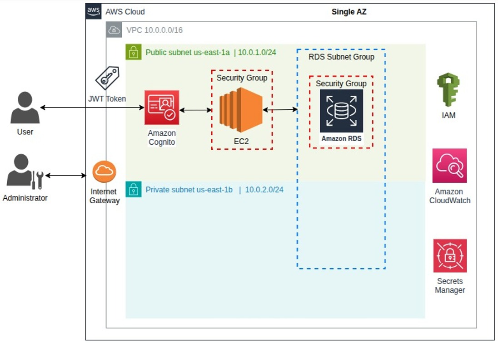

# restful-rds-golang-products

RESTful microservice that allows the management of soccer tournament data. It uses AWS cloud resources and
is provisioned and deployed using Terraform.

  

    aws ec2 modify-subnet-attribute \
    --subnet-id subnet-07ab674ef6e9292c6 \
    --map-public-ip-on-launch

## Run application

    docker-compose down -v --rmi all
    docker-compose up --build -d

## Accesss database

    psql -h db-instance-rds.c8le640i0kbl.us-east-1.rds.amazonaws.com -U p0stgr3s -d products -p 5432

    psql -h db-instance-rds-tf.c8le640i0kbl.us-east-1.rds.amazonaws.com -U p0stgr3s -d products -p 5432

aws rds describe-db-instances \
    --db-instance-identifier db-instance-rds-tf \
    --region us-east-1 \
    --query "DBInstances[0].DBSubnetGroup.Subnets[0].SubnetIdentifier" \
    --output text

## API Endpoints

    curl -X GET http://localhost:9090/v1/products

    curl -X POST http://localhost:9090/v1/products \
    -H "Content-Type: application/json" \
    -H "X-API-Key: super_secreto_api_key_valida" \
    -d '{
        "name": "Nuevo Producto de Prueba",
        "description": "Una descripción de este producto",
        "price": 50.00
    }'

Se esta harcodeando el pool en main.go (corregir)

JWKS

API Gateway: {"message":"Unauthorized"}

- Las instancias se quedan pegadas, se requiere eliminarlas por la consola web para que el terraform no finalice con error. De lo contrario es necesario ejecutar un comando para remover algun estado pendiente si hay dependencias.

- 

